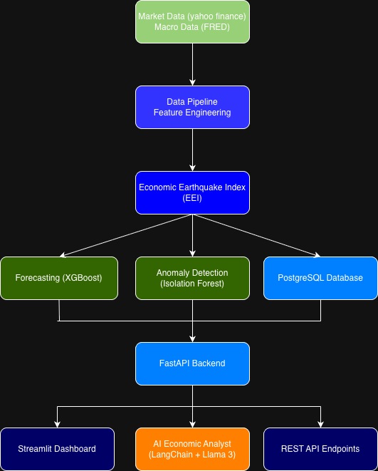
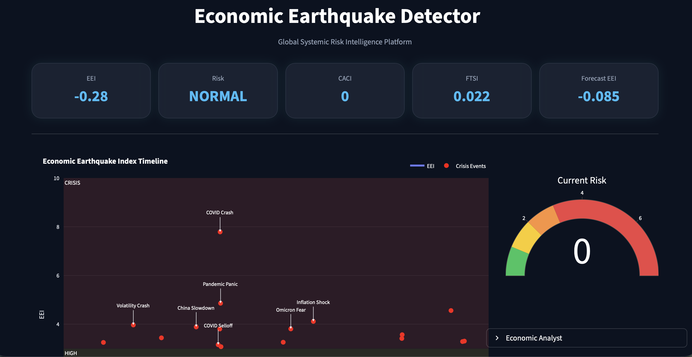
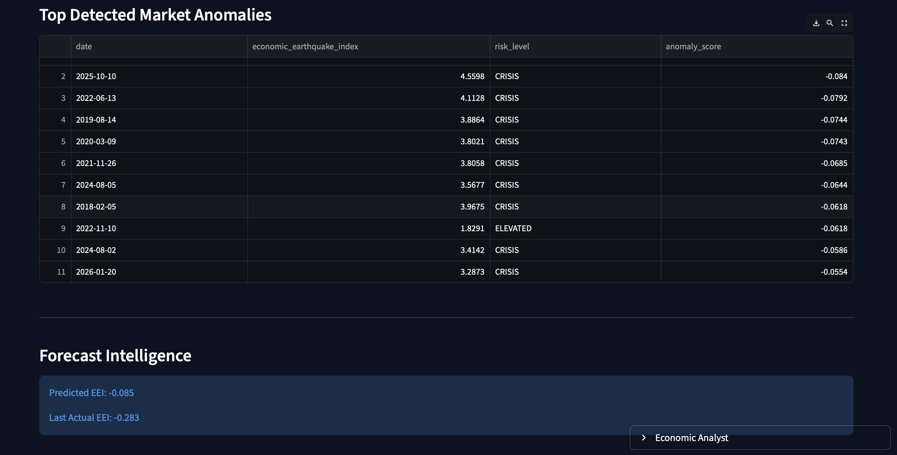
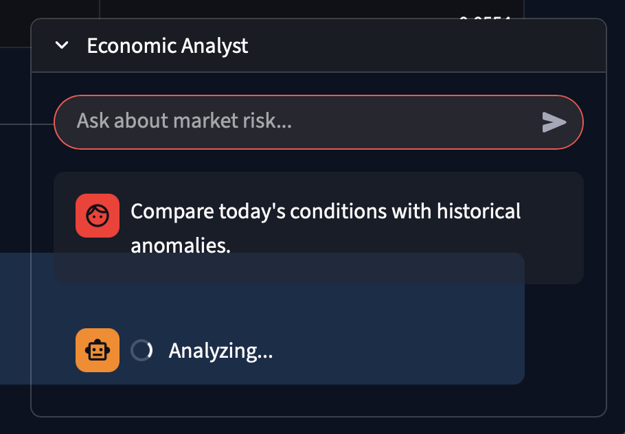

# Economic Earthquake Detector

## Overview

Financial crises often feel sudden.

One day markets appear stable and the next day panic spreads across stocks, bonds, commodities and currencies. While studying machine learning and data science, I became interested in understanding whether such events leave detectable warning signals before they become obvious.

This curiosity led me to build the **Economic Earthquake Detector**, an AI-powered platform that attempts to measure systemic stress in financial markets, identify unusual events, forecast future risk and explain market conditions in natural language.

My idea is inspired by how earthquakes are monitored using multiple signals. Similarly, this project combines signals from different parts of the financial system and converts them into a single indicator called the **Economic Earthquake Index (EEI)**.

The project combines concepts from:

- Data Engineering
- Machine Learning
- Time Series Forecasting
- Anomaly Detection
- Database Systems
- API Development
- Generative AI

and integrates them into a single end-to-end platform.

---

## Motivation

During major crises such as the COVID-19 market crash and inflation-driven market shocks, risk rarely emerged from a single source. Instead, stress propagated across multiple assets and markets.
Traditional indicators often focus on one market at a time. I wanted to explore whether it was possible to create a unified framework capable of:

- Measuring systemic market stress
- Detecting unusual market behavior
- Forecasting future risk levels
- Explaining risk using AI

The result is the Economic Earthquake Detector.

---

## Project Objectives

The main objectives of this project are:

1. Build a composite indicator capable of measuring systemic financial stress.
2. Detect abnormal market events using machine learning.
3. Forecast future risk levels.
4. Store and manage results using a database.
5. Visualize risk through an interactive dashboard.
6. Develop an AI analyst capable of explaining market conditions using real project data.

---

## System Architecture



The system follows a modular architecture.

### Data Layer

Market and macroeconomic data are collected and processed to create features representing different forms of financial stress using the sources like yahoo finance and FRED.

### Risk Engine

The processed features are then combined into the Economic Earthquake Index (EEI), which serves as the central risk indicator.

### Machine Learning Layer

Two machine learning models are used:

#### Anomaly Detection

Isolation Forest is used to identify unusual market conditions that differ significantly from historical patterns.

#### Forecasting

XGBoost is used to forecast future values of the Economic Earthquake Index using lag-based features.

### Database Layer

All generated indicators, forecasts and anomaly results are stored in PostgreSQL.

### API Layer

FastAPI exposes the processed information through REST endpoints.

### AI Layer

LangChain and Llama 3 are used to build an Economic Analyst that can answer questions using data generated by the platform.

### Visualization Layer

A Streamlit dashboard provides an interactive interface for exploring risk indicators, forecasts, anomalies and AI-generated explanations.

---

## Key Components

### Economic Earthquake Index (EEI)

The Economic Earthquake Index is the primary output of the system. It combines multiple indicators into a single measure of systemic risk. so, higher values indicate increased stress across financial markets.

---

### Cross Asset Contagion Index (CACI)

This indicator attempts to measure how stress spreads between different asset classes.
Higher contagion levels often indicate that risk is no longer isolated and may be becoming systemic.

---

### Flight To Safety Index (FTSI)

The Flight To Safety Index measures investor behavior during periods of uncertainty.

When investors move capital away from risky assets toward safer alternatives, this indicator tends to increase.

---

## Machine Learning Models

### 1. Isolation Forest

Isolation Forest is used to identify unusual observations in the Economic Earthquake Index.

Results:

- Total observations analyzed: 3654
- Anomalies detected: 37

Some detected anomalies correspond to major periods of market stress, including:

- COVID-19 Market Crash (March 2020)
- Oil Price Collapse (2020)
- Inflation and Interest Rate Shock Events

---

### 2. XGBoost Forecasting Model

XGBoost is used to forecast future EEI values using lagged historical observations.

Model Performance:

- MAE: 0.3721
- RMSE: 0.5825

These forecasts help estimate short-term changes in systemic market risk.

---

## AI Economic Analyst

One of the most interesting parts of this project is the AI Economic Analyst.
Instead of relying only on charts and numbers, users can ask questions in natural language.

Examples:

- What is today's risk level?
- How does today's risk compare to historical crises?
- What does the forecast suggest about tomorrow?
- Are current conditions similar to COVID-era stress?

The AI Analyst retrieves:

- Current EEI values
- Forecast results
- Historical anomalies

from PostgreSQL and then uses LangChain with Llama 3 to generate explanations.

This allows the platform to move beyond visualization and provide actual insights.

---

## Technology Stack

### Programming

- Python

### Data Processing

- Pandas
- NumPy

### Database

- PostgreSQL
- SQLAlchemy

### Machine Learning

- Scikit-Learn
- Isolation Forest
- XGBoost

### Backend

- FastAPI

### Frontend

- Streamlit
- Plotly

### AI

- LangChain
- Ollama
- Llama 3

---

## Project Structure

```text
economic-earthquake-detector/

├── backend/
│   ├── ai/
│   ├── api/
│   ├── database/
│   └── models/
│
├── frontend/
│   ├── components/
│   └── assets/
│
├── experiments/
├── notebooks/
├── images/
│
└── README.md
```

---

## Quick Start

```bash
source venv/bin/activate

uvicorn backend.api.main:app --reload
```

Open another terminal:

```bash
streamlit run frontend/dashboard.py
```

## How to Run the Project step by step to test all of the archietectural layer.

### 1. Clone the Repository

```bash
git clone https://github.com/your-username/economic-earthquake-detector.git

cd economic-earthquake-detector
```

---

### 2. Create a Virtual Environment

```bash
python3 -m venv venv
```

Activate:

```bash
source venv/bin/activate
```

---

### 3. Install Dependencies

```bash
pip install -r requirements.txt
```

---

### 4. Start PostgreSQL

Make sure PostgreSQL is running and create the database:

```sql
CREATE DATABASE economic_earthquake;
```

Update database credentials inside:

```text
backend/database/database.py
```

---

### 5. Generate EEI Data

Run the data pipeline:

```bash
python backend/models/create_eei.py
```

---

### 6. Run Anomaly Detection

```bash
python backend/models/detect_anomalies.py
```

This creates:

```text
eei_anomalies
```

inside PostgreSQL.

---

### 7. Run Forecasting

```bash
python backend/models/forecast_eei.py
```

This creates:

```text
eei_forecasts
```

inside PostgreSQL.

---

### 8. Install Ollama

Download:

https://ollama.com

Pull Llama 3:

```bash
ollama pull llama3
```

Verify:

```bash
ollama run llama3
```

---

### 9. Start FastAPI Backend

```bash
uvicorn backend.api.main:app --reload
```

API documentation:

```text
http://127.0.0.1:8000/docs
```

---

### 10. Launch Streamlit Dashboard

Open a new terminal:

```bash
streamlit run frontend/dashboard.py
```

Dashboard:

```text
http://localhost:8501
```

---

### 11. Use the AI Economic Analyst

Example questions:

```text
What is today's risk level?

Compare today's conditions with historical anomalies.

What does tomorrow's forecast suggest?

Are current conditions similar to the COVID crash?
```

The AI analyst uses:

- PostgreSQL
- FastAPI
- LangChain
- Ollama
- Llama 3

to generate responses using real project data.
---

## Challenges Faced

While building this project, I encountered several challenges:

- Designing a meaningful risk indicator from multiple market signals
- Building a reliable forecasting pipeline
- Integrating machine learning outputs with PostgreSQL
- Connecting FastAPI and Streamlit efficiently
- Running local LLMs through Ollama
- Building an AI analyst capable of using project-generated data instead of relying on generic responses

Working through these challenges significantly improved my understanding of machine learning systems and AI application development.

---

## Future Improvements

There are several directions in which this project can be expanded:

- Real-time market data ingestion
- Financial news integration
- Retrieval-Augmented Generation (RAG)
- Multi-agent economic research system
- Cloud deployment
- Live monitoring and alerting
- Advanced forecasting models
- Global macroeconomic risk tracking

---

## Learning Outcomes

This project helped me gain practical experience in:

- Machine Learning
- Time Series Forecasting
- Anomaly Detection
- Data Engineering
- Database Design
- API Development
- Dashboard Development
- Generative AI
- LangChain
- LLM Application Development

More importantly, it taught me how to combine multiple technologies into a complete end-to-end AI system rather than building isolated models.